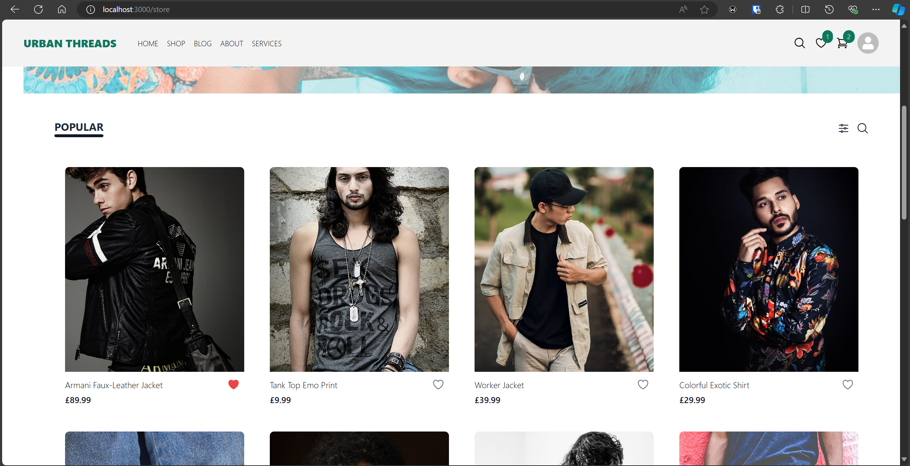
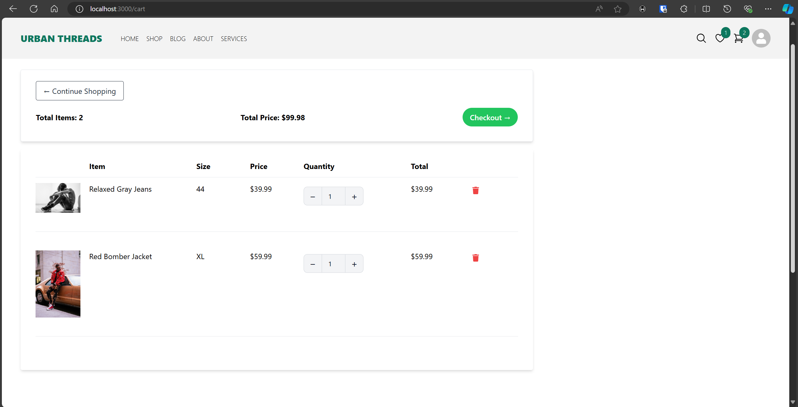
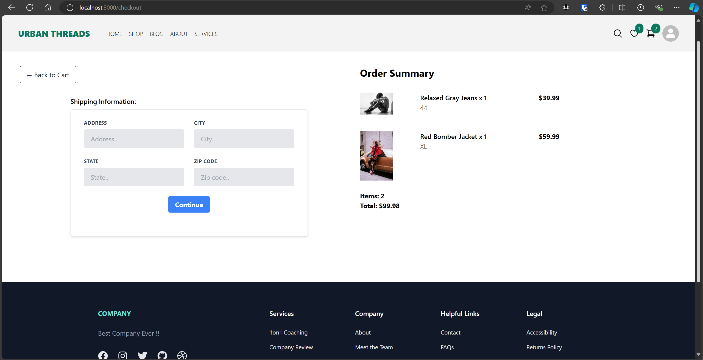
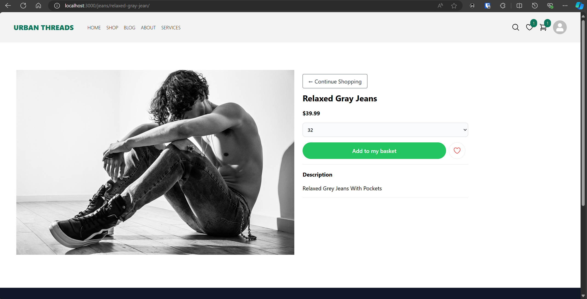
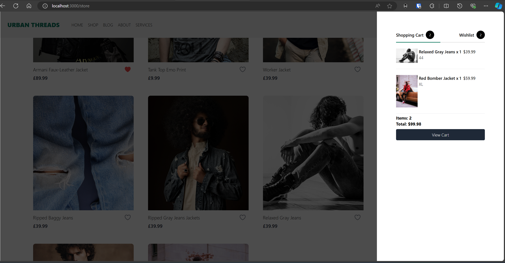
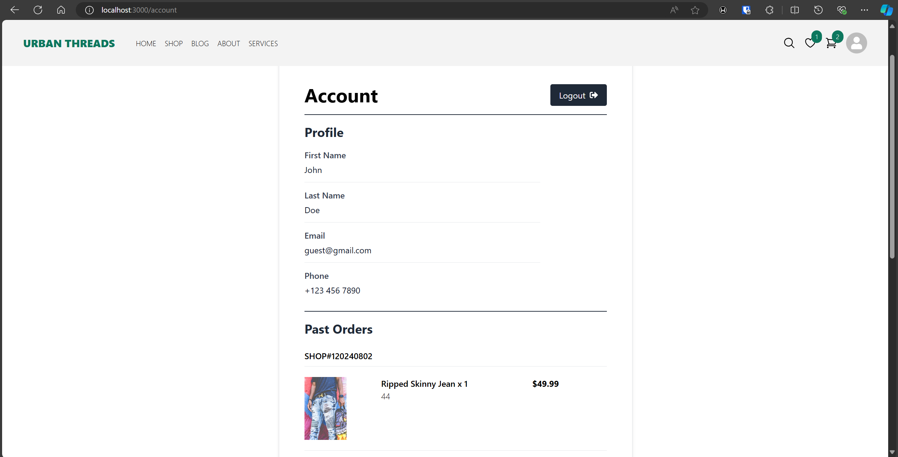

# ClothingStore

## 🚀 Description
Full-stack Clothing Store web application built with Django REST Framework (DRF) as backend, React as frontend and TailwindCSS for styling.

## 🖼️ Screenshots

### HomePage

### Cart

### Checkout

### ProductView

### Cart Sidebar 

### Account


## ⚙️ Prerequisites

Before you begin, ensure you have the following installed:
- Python 3.x
- Node.js and npm

## 📥 Setup
1. Clone the repository
```
git clone https://github.com/jjoenasr/ClothingStore
```

2. Backend Setup
```
cd backend
pip install -r requirements.txt
python manage.py migrate
```

3. Frontend Setup
```
cd frontend
npm install
```

## 🎯 Usage
1. Run the backend server
```
cd backend
python manage.py runserver
```

2. Run the frontend UI:
```
cd frontend
npm start
```

3. Open your browser and navigate to `http://localhost:3000`
